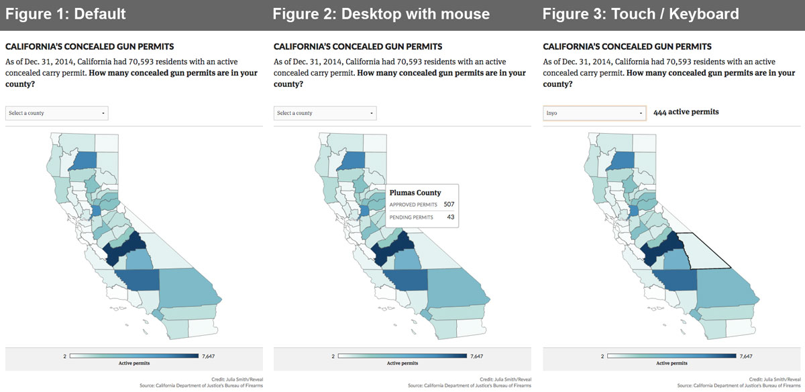
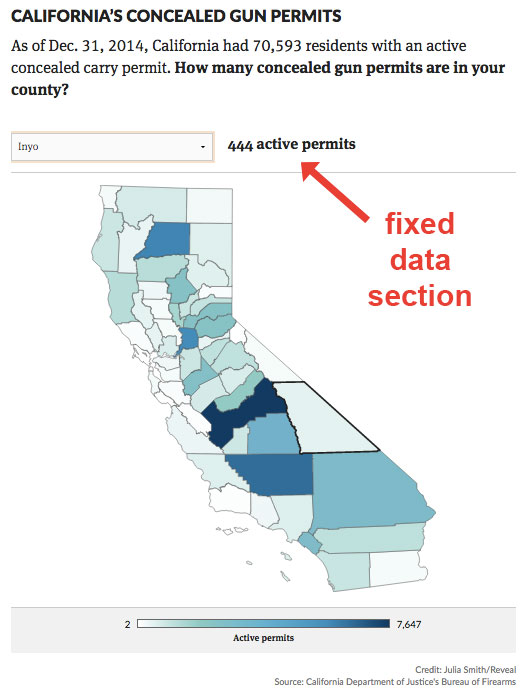

# Pre-Production Checklist
* Is it [**responsive**](#responsive)?
* Does is have special features for [**touch devices**](#touch-support)?
* Are [**hit areas**](#hit-areas) appropriately sized?
* Are [**alternative selection mechanisms**](#alternative-selection-mechanisms) in place?
* Are there [**incompatibility fallbacks**](#incompatibility-fallbacks) for unsupported browsers?
* Is all information [**accessible via keyboard**](#keyboard-support)?
* Are there [**visible states**](#visible-states) for focus/hover/selected?
* Is there a [**fallback for tooltips**](#tooltip-alternative)?
* Are tables legible and accessible?
* How did it perform on [**PageSpeed**](#pagespeed-evaluation)?
* Is it error-free on [**WAVE**](#wave-evaluation)?

<hr />
##Responsive:
* Test the graphic on as many devices as possible and make sure it flows appropriately and doesn't break out of the viewport.
* Use the viewport meta tag in your HTML. 

        <meta name="viewport" content="width=device-width, initial-scale=1">
 * More on sizing content: [Viewport Meta Tag](https://developer.mozilla.org/en-US/docs/Mozilla/Mobile/Viewport_meta_tag) | Mozilla Developers
* Use CSS media queries.

        @media all and (max-width: 768px) {}
 * More on media queries: [Media Queries for Standard Devices](https://css-tricks.com/snippets/css/media-queries-for-standard-devices/) | CSS Tricks
* More on RWD fundamentals: [Responsive Web Design Basics](https://developers.google.com/web/fundamentals/layouts/rwd-fundamentals/index?hl=en) | Google Developers

<hr>
##Touch Support:
* Some interactives may require specific enhancements for touch devices.
 * Example: Disable mouse events on a map and use a native control, like a select box, instead. ([How?](#alternative-selection-mechanisms))
* To isolate UI elements and interactions for touch devices, test for mobile **user agent strings** and add a CSS class to the containing element. This way you can use touch-only CSS and JS selectors.

        var touch;
        if (/Android|webOS|iPhone|iPad|iPod|BlackBerry/i.test(navigator.userAgent)) {
          touch = true;
          var wrapper = document.getElementById('interactive-wrapper');
          wrapper.className += ' touch-device';
        }
The above JS snippet tests for the user agent and – if it's a touch device – sets the variable ```touch``` to ```TRUE``` and adds the class ```touch-device``` to the interactive's container. This way you can write touch-only CSS like below, which will increase the size of an SVG circle on touch devices:
    
        .touch-device circle {  
          r: 30;
          stroke-width: 8;
        }
    You can also now write JS like below, which will only add event listeners for mouse actions if the user is *not* on mobile:

        if (!touch){
          elem.addEventListener( 'mouseover', function(e) {
            tooltipInfo(e.target);
            tooltip.style.display = 'block';
          });
          elem.addEventListener( 'mouseout', function() {
            tooltip.style.display = 'none';
          });
        } 
* More on designing for touch: [Fingers, thumbs, and people](http://interactions.acm.org/archive/view/may-june-2015/fingers-thumbs-and-people) | Steven Hoober

<hr>
##Hit Areas:
* Tap targets should be large enough to touch on mobile – at least 30x30 pixels or so.
* Links and tap targets should be spaced appropriately so users won't accidentally hit the wrong link.
* Use media queries to make the necessary adjustments to your design. (See [Responsive](#responsive) above.)
* For some graphics (like SVG maps) that are scaled down by device width, hit areas will become too small on certain devices. To compensate:
 * Provide a different means to access the data. (See [Alternative Selection Mechanisms](#alternative-selection-mechanism) below.)
 * **Don't disable pinch-zoom!** Ensure your users can zoom in on a desired area of your graphic.
* Lively discussion on pinch-zoom: [Disabling Pinch Zoom on Mobile Web](http://stackoverflow.com/questions/11689353/disable-pinch-zoom-on-mobile-web) | StackOverflow
* More on hit areas: [Finger-Friendly Design](http://www.smashingmagazine.com/2012/02/21/finger-friendly-design-ideal-mobile-touchscreen-target-sizes/) | Smashing Magazine

<hr>
##Alternative Selection Mechanisms:
* If your graphic includes a custom way to access data, also provide a native control (select box, radio buttons, etc.) so your user can access the data in your interactive more easily via keyboard or their mobile device.


* In the above example, data embedded in the map is available both by hovering over a county *and* by using the select box to pick a county. This accomplishes two things:
 * It makes the data accessible via keyboard.
 * It allows geographicaly small areas (like San Francisco County) to be more easily selected on mobile devices.
* The tricky part is keeping the two selection mechanisms (the map and the select box) in sync. Here are the functions that operate the select box:

        function countySelect(){
		  var select = document.getElementById("cir-map-select");
		  select.onchange = function(){
		    var value = select.value;
		    updateSelectionInfo(value);
		  }
		}

		function updateSelectionInfo(value){
		  var info = document.getElementById("cir-map-info");
		  if (value != "Select a county"){
		    var svgCounty = document.getElementById(value);
		    var dataCounty = svgCounty.getAttribute("data-name");
		    var dataApproved = svgCounty.getAttribute("data-approved").toString().replace(/\B(?=(\d{3})+(?!\d))/g, ",");
		    var html = "<div class='info-inner'><span class='county-group'>" + dataApproved + " active permits</span></div>";
		    info.innerHTML = html;
		    updateSelectedPath(svgCounty);     
		  } else {
		    info.innerHTML = "";
		    deselectPath();
		  }
		}

		function updateSelectedPath(path){
		  deselectPath();   
		  if (path.getAttribute('data-selected') == 'true'){
		    path.setAttribute('data-selected', 'false');
		  } else {
		    path.setAttribute('data-selected', 'true');
		  } 
		  path.setAttribute('data-selected', 'true');
		  var parent = path.parentNode;
		  parent.appendChild(path);
		}

		function deselectPath(){
		  var selected = document.querySelector('.cir-county[data-selected="true"]');
		  if (selected) {
			selected.setAttribute('data-selected', 'false');
		  }
		}
    
    Then the map paths also update the select box:

        elem.addEventListener( 'click', function(e) {
          var countyID = e.target.id;
          var select = document.getElementById("cir-map-select");           
          if (e.target.getAttribute('data-selected') == 'true'){
            select.value = "Select a county";
            e.target = "";
            countyID = "Select a county";
          } else {
            select.value = countyID;
          }
          updateSelectedPath(e.target);
          updateSelectionInfo(countyID);
        }); 

<hr>
##Incompatibility Fallbacks:
* Provide feedback to users who turn off javascript:

		<style>
		  .compatibility-error {display:none;}
		</style>
	    
	    <noscript>
	      <style>
	        .viz-container {display:none;}
	        .compatibility-error {display:block;}
	      </style>
	    </noscript>
	    <div class="compatibility-error">This interactive feature requires a modern browser with JavaScript enabled.</div>

* Provide feedback to users who use browsers you don't support:

        <!--[if lt IE 9]>
	      <style>
	        .county-selection-wrapper, #interactive-wrapper, .cir-map-legend, .credit {display:none;}
	      </style>
     	  <p class="browsehappy">You are using an <strong>outdated</strong> browser. Please <a href="http://browsehappy.com/">upgrade your browser</a> to improve your experience.</p>
	    <![endif]-->

<hr>
##Keyboard Support:
* Test for keyboard support by tabbing through your UI to make sure important elements are focusable.
* Test for screen reader support with a tool like [ChromeVox](https://chrome.google.com/webstore/detail/chromevox/kgejglhpjiefppelpmljglcjbhoiplfn), a screen reading browser extension for Chrome. This tool will let you hear information as you tab through an interface. Make sure data in your interactive is audible.
* Use the ```tabindex``` attribute to give elements keyboard focus.

        <div tabindex="0" role="button">focusable element</div>
 * ```tabindex="0"``` will place the element in default navigation order. **0 is the value you should use most often.**
 * ```tabindex="-1"``` will remove the elment from default navigation order but allow it to receive focus programmatically.
 * ```tabindex="2"``` ...or 3, 4, 5, etc. will place elements in the specified order.
* Include event listeners for ```focus```, ```blur```, and ```keydown``` in order to trigger interaction via keyboard events in JS.
        
		$('#us-map circle').focus(function(){ 
       	  var $this = $(this);
		  getCircleData($this);
		  $('.map-info').css('display', 'block');
        });

        $('#us-map circle').blur(function(){ 
          $('.map-info').css('display', 'none');
        });

		$('.cir-map-state').keydown(function(e){ 
		  var code = e.which;
		  // 13 = Return, 32 = Space
		  if ((code === 13) || (code === 32)) {
		  	$(this).trigger('click');
		  }
		});
* More on keyboard support: [Keyboard Accessibility](http://webaim.org/techniques/keyboard/) | WebAIM

<hr>
##Visible States:
* Use *distinct, visible* styles for the different element states:
 * default
 * hover
 * selected
 * focus

<hr>
##Tooltip Alternative:
* For mobile especially (but also for keyboard navigation), display tooltip data on a fixed area of the screen.
* Fixed data sections help prevent the user's fingers from getting in the way of the data.

<p align="center">

</p>

<hr>
##PageSpeed Evaluation:
* Run your graphic through [WebPageTest](http://www.webpagetest.org/) and/or [PageSpeed Insights](https://developers.google.com/speed/pagespeed/insights/).
* More performance resources: [Links!](https://docs.google.com/presentation/d/1tBcVjf0qnxnsE8K9h_dn7rAckRQUfi3Blu3wlUBt3Ws/edit) | Julia Smith

<hr>
##WAVE Evaluation:
* Use the [WAVE Evaluation Chome Plugin](https://chrome.google.com/webstore/detail/wave-evaluation-tool/jbbplnpkjmmeebjpijfedlgcdilocofh?hl=en-US) or [WAVE Evaluation Firefox Toolbar](https://addons.mozilla.org/En-us/firefox/addon/wave-toolbar/) to make sure you didn't overlook any accessibility issues.
